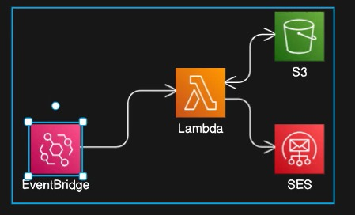

# 🚀 **Automated, Scalable Email Campaigns Using AWS Serverless Architecture**
## 🔍 At a Glance

### 🧩 Problem it Solves
Helps **college campus ambassadors** (like Unstop student reps) **automate mass email delivery** to registered students using a **custom domain**, without managing servers. Enables them to promote hackathons, coding challenges, and reminders **on schedule** without manual effort.

### ✨ Key Features
- 📩 **Send bulk emails with HTML templates** using your own domain
- ⏰ **Schedule mail campaigns** precisely using AWS EventBridge
- 🌐 **Completely serverless setup** — no need to manage or maintain servers
- 🗃️ **Easy customization** for subject, body, recipient list, and templates
- 🛠️ One-click deployment with AWS services (Lambda, SES, EventBridge)
- 🔒 Uses verified sender domain (Unstop or other custom) for higher deliverability

### 🛠️ Tech Stack
- **Cloud Platform**: AWS (Lambda, SES, EventBridge)  
- **Languages**: Python, HTML  
- **Other Tools**: Amazon IAM, Git  
---

## 🧠 Overview

This project demonstrates a fully serverless email marketing solution leveraging AWS services. It automates the process of sending personalized HTML emails to a list of contacts stored in a CSV file on Amazon S3. The application is designed for scalability, cost-effectiveness, and ease of deployment.

---

## 🔧 AWS Services Utilized

| Service                 | Purpose                                                                 |
|-------------------------|-------------------------------------------------------------------------|
| **Amazon S3**           | Stores the CSV contact list and HTML email templates                    |
| **AWS Lambda**          | Executes the email-sending logic in a serverless environment            |
| **Amazon SES**          | Sends the personalized HTML emails to recipients                        |
| **Amazon EventBridge**  | Triggers the Lambda function on a scheduled basis                       |
| **AWS IAM**             | Manages permissions and access control for AWS resources                |

---

## 🗂️ Project Structure

```
Serverless-Email-Marketing-Application/
├── images/                         # Contains architecture diagrams and related images
├── lambda_function/
│   ├── lambda_function.py          # Main Lambda function code
│   ├── contacts.csv                # Sample CSV file with contact information
│   ├── email_template.html         # HTML template for the email content
│   └── test_event.json             # Sample event for testing the Lambda function
├── README.md                       # Project documentation
```

---

## 🧭 Architecture Diagram



*This diagram illustrates the serverless workflow:*

1. **Amazon EventBridge** triggers the **AWS Lambda** function on a defined schedule.
2. The Lambda function reads the **contacts.csv** and **email_template.html** from **Amazon S3**.
3. For each contact, the Lambda function personalizes the email content.
4. **Amazon SES** sends the personalized emails to the respective recipients.

---

## 🚀 Getting Started

### Prerequisites

- AWS account with necessary permissions for Lambda, S3, SES, EventBridge, and IAM.
- Verified email addresses in Amazon SES (for sandbox environments).

### Deployment Steps

1. **Clone the Repository:**

   ```bash
   git clone https://github.com/ManojCodeCraft/Serverless-Email-Marketing-Application.git
   cd Serverless-Email-Marketing-Application
   ```
2. **Configure AWS Resources:**

   - Upload `contacts.csv` and `email_template.html` to your designated S3 bucket.
   - Set up Amazon SES and verify sender/recipient emails.
   - Create an EventBridge rule to trigger the Lambda function on your desired schedule.

3. **Deploy the Lambda Function:**

   - Package and deploy the Lambda function using AWS CLI or AWS Console.
   - Ensure the Lambda function has the necessary IAM role with permissions to access S3 and SES.

---

## 📬 Email Personalization

The `email_template.html` file uses placeholders (e.g., `{{FirstName}}`) that are dynamically replaced with actual contact data from the `contacts.csv` file during execution. This allows for personalized email content for each recipient.

---

## 🧪 Testing

You can test the Lambda function locally by simulating an event using the `test_event.json` file:

```bash
python lambda_function/lambda_function.py
```
## 📽️ Demo Video:

🎥 [Watch Demo on Google Drive](https://drive.google.com/file/d/1mUFokEZ9Mxr3EOqOoB1xqOLg7rFnjTqI/view?usp=sharing)

Ensure that the AWS credentials and configurations are properly set up in your environment.


## 📃 License

This project is licensed under the [MIT License](LICENSE)
